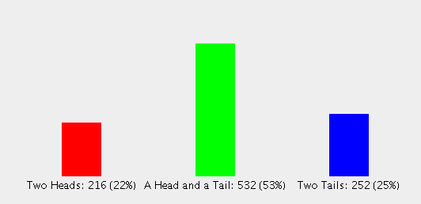
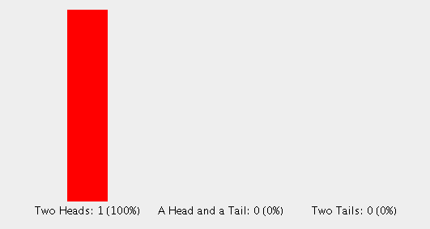

# Coin Toss Simulator
A basic program to project and display the resulting probabilities of flipping two coins.

Two coins are tossed X number of times. The results display the number of outcomes of two heads, two tails and one of each.

## Application Flow

